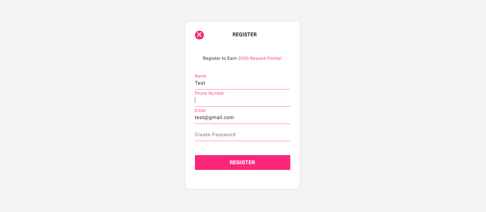
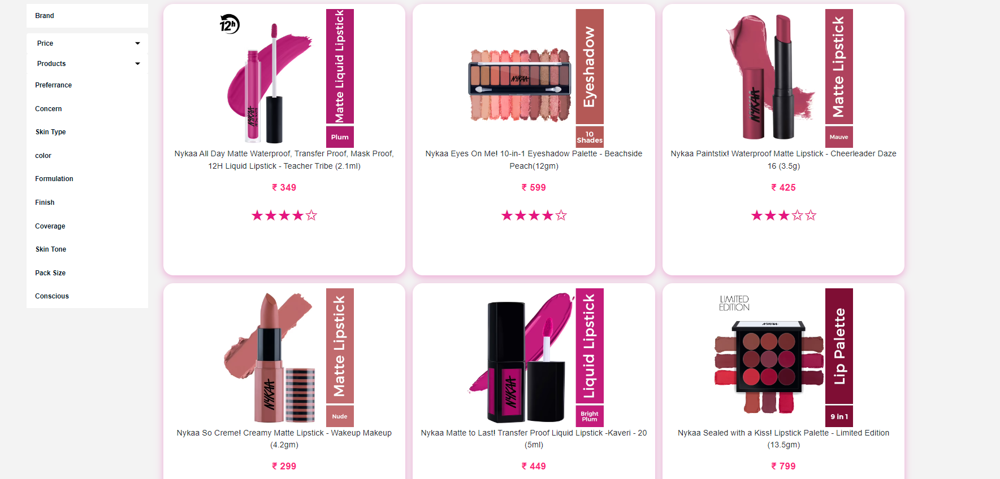
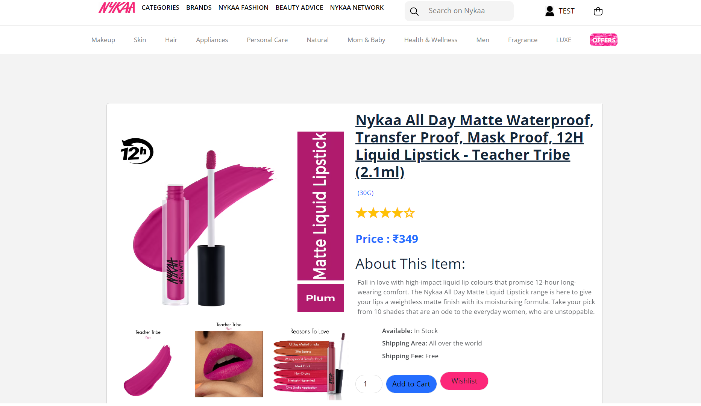
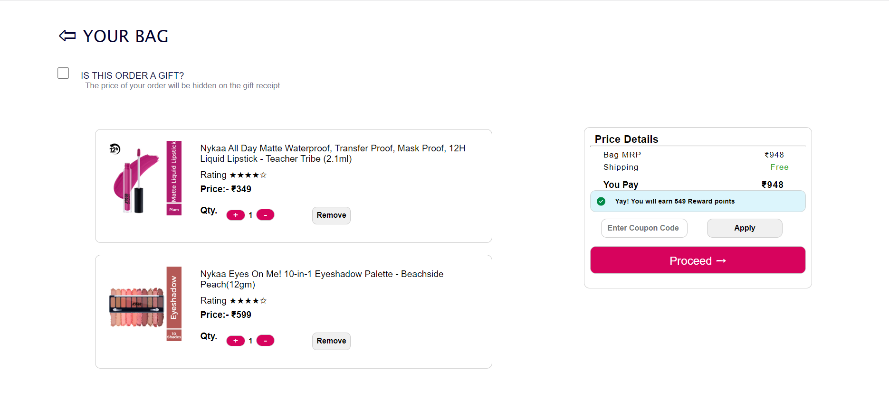
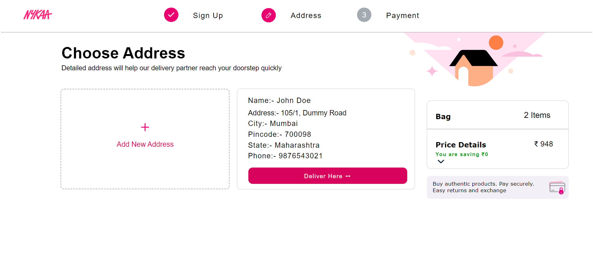
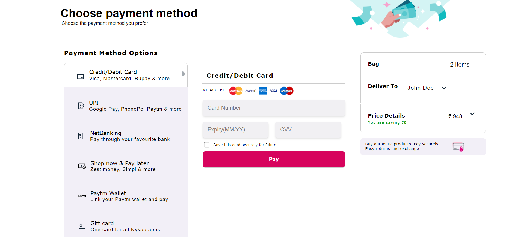
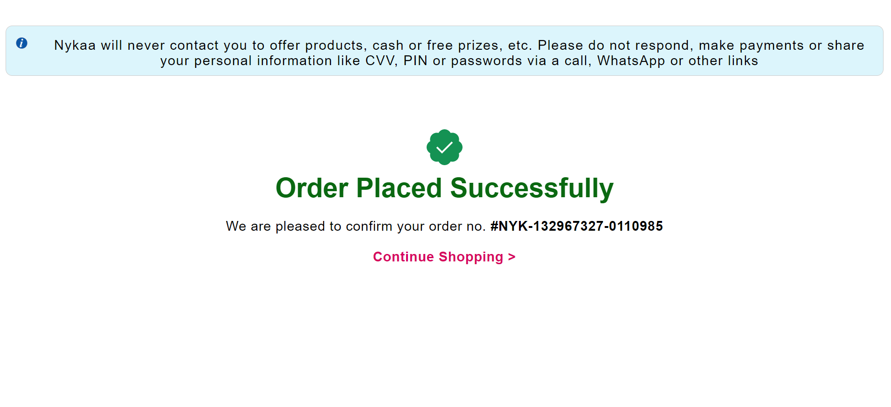

# nykaa-clone

#### Nykaa is an Indian e-commerce Mumbai-based retail seller of beauty, fashion and wellness products. The ecommerce startup lists products from over 1200 global brands along with its own line of products Nykaa Cosmetics and Nykaa Naturals.It sells beauty,wellness and fashion product across website,mobile apps and 76 offline store.

#### In this project we have tried to make a look alike clone of Nykaa. With our efforts and the technology stack, that we have learned so far in the masai school.

### Deployed Link:  
<a href="https://nyka.netlify.app/">https://nyka.netlify.app</a>

## Technology Stack Used
<ul>
<li>HTML5</li>
<li>CSS</li>
<li>JavaScript (LocalStorage, DOM, Api)</li>
<li>Json-Server</li>
</ul>

## How to browse through the project?
In order to use the project you need to follow the below steps.

### Landing Page:
Fully Responsive Landing Page, having navbar and footer.

 

  

### Sign in Page:
This is the Sign-Up & Sign-In of the clone website. Enter Your Email to sign in.

 

 
 

### Product Page
In the product page we see various products on the basis of popularity and also user can sort the products on the basis of their prices and there is options to add products in cart and if we click on particular product, the user will navigate to the product detail page.

 

  

### Product Details Page
In the page we see the particular product we clicked.

  

### Cart Page
User can see all those products that he added to the Bag. User also can increase or decrease quantity and apply the coupon code to get the discount. After clicking on proceed user will navigate to address page.

 
  

### Address Page:
Here user will have to add Address. And also on the right side user can get the total price of the products. After clicking on "Deliver Here"  button user will be redirected to payment page.

 

  

### Payment Page
Here user will get the different options for payment. By entering all the correct information and entering correct otp user would make payment successfully.

 

  

### Order Confirmation Page
After successful payment user will get order confirmation message with order no.

 

 
 
 

# Contributors
 

### Arpit Saraswat <a href="https://github.com/ArpitSaraswat1997">github.com/ArpitSaraswat1997</a>
### Pawan Singh <a href="https://github.com/almightycoder4">github.com/almightycoder4</a>
### Sourav Jana <a href="https://github.com/sourav215">github.com/sourav215</a>
### Nitesh R. Lanjewar <a href="https://github.com/kartikCod3">github.com/kartikCod3</a>
### Animesh <a href="https://github.com/animeshpw08049">github.com/animeshpw08049</a>
